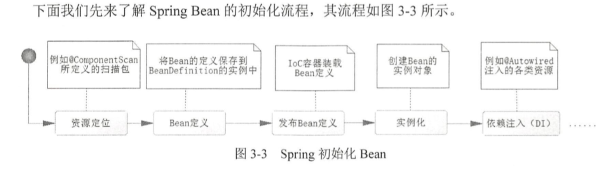
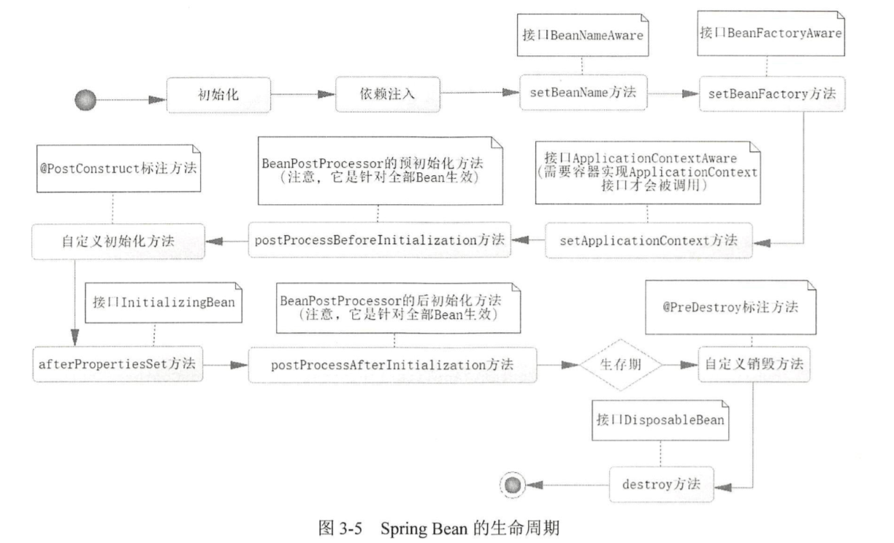
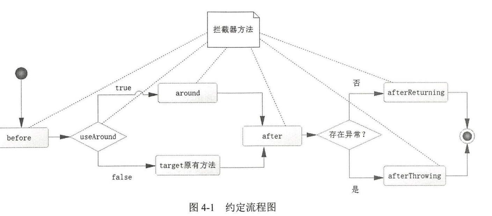

#### Java是一门面向对象编程语言。一个Java程序可以认为是一系列对象的集合，而这些对象通过调用彼此的方法来协同工作。
<!--more-->
1. 基本语法
* 大小写敏感
* 类名首字母大写，如果类名由多个单词组成，那么每个单词的首字母应该大写
* 所有的方法名都应该以小写字母开头。如果方法名含有若干单词，则后面的每个单词首字母大写
* 原文件名必须和类名相同
* 所有的Java程序由public static void main(String []args)方法开始执行
2. Java标识符(Java所有的组成部分都需要名字。类名、变量名及方法名都被称为标识符)
* 所有的标识符都应该以字母，$，或者下划线开始
* 首字符以后可以是字母，美元符，下划线或数字的任何字符组合
* 关键字不能做标识符
* 标识符大小写敏感
3. Java增强for循环
* Java5引入了一种主要用于数组的增强型for循环，语法格式如下：
```
for(声明语句:表达式)
{
    //代码句子
}
```
声明语句：声明新的局部变量，该变量的类型必须和数组元素的类型匹配。其作用域限定在循环语句块，其值与此时数组元素的值相等。

表达式：表达式是要访问的数组名，或者是返回值为数组的方法
#### Spring Boot   约定优于配置
1. 优点
* 创建独立的spring应用程序
* 嵌入的Tomcat、Jetty或者Undertow，无需部署WAR文件
* 允许通过Maven来根据需要获取starter
* 尽可能的自动配置Spring
* 提供生产就绪型功能，如指标、健康检查和外部配置
* 绝对没有代码生成，对XML没有要求配置
2. IOC （Inversion of Control）  控制反转容器
* 是Spring的核心，是一种通过描述来获取或者生成对象的技术
* 功能
    * 通过描述管理Bean，包括发布和获取Bean    （在Spring中把每一个需要管理的对象称为Bean）
    * 通过描述完成Bean之间的依赖关系
3. 注解
    1. @ComponentScan 扫描当前类所在的包和子包
        * @Filter的类型及意义
            ```
            ANNOTATION:注解类型
            ASSIGNABLE_TYPE:ANNOTATION:指定的类型
            REGEX:按照正则表达式
            CUSTOM:i定义规则
            ```
    2. @Configurable  表示是Java的配置文件
    3. @Bean 将此方法返回的 POJO 装配到 IoC 容器中，而其属性 name 定义这个 Bean 的名称，如果没有配置它，则将方法名称作为 Bean 的名称保存到 Spring IoC 容器中 。
    4. @SpringBootApplication 是一个复合注解，包括@ComponentScan，和@SpringBootConfiguration，@EnableAutoConfiguration
    5. @Component    //表明这个类将被 Spring IoC 容器扫描装配
    6. @Autowired    //根据属性的类型（by type）找到对应的 Bean 进行注入，＠Autowired 提供这样的规则， 首先它会根据类型找到对应的 Bean, 如果对应类型的 Bean 不是唯一的，那么它会根据其属性名称和 Bean 的名称进行匹配。如果匹配得上，就会使用该 Bean：如果还无法匹配，就会抛出异常。 
    7. @Primary   //消除歧义性，修改优先权
    8. ＠Quelifier  与＠Autowired 组合在一起，通过类型和名称一起找到 Bean
    9. @Override  重写，验证下面的方法名是否是你父类中所有的
    10. @Conditional 只有在特定条件满足时才启用一些配置
    11. @ImportResource ，通过它可以引入对应的 XML 文件，用以加载Bean
    12. ＠Aspect  当以此为注解时，spring就会知道这是一个切面，然后我们就可以通过各类注解来定义各类的通知了
    13. ＠Repository  在将来讨论扫描加载MyBatis接口Bean时是十分有用的
    14. @Responsebody 该方法的返回结果直接写入HTTP response body中，一般在异步获取数据时使用
4. DI （Dependency Injection） 依赖注入
    
        例如，人类（ Person ）有时候利用一些动物 (Animal）去完成一些事情，比方说狗（Dog）是用来看门的，猫（Cat）是用来抓老鼠的， 鹦鹉（Paηot)是用来迎客的……于是做一些事情就依赖于那些可爱的动物了
5. 生命周期
    
    生命周期：
    
6. 约定编程
    
    AOP（面向切面编程）可以解决对数据库事务的管控问题，还可以减少大量重复的工作。使用Spring AOP可以处理一些无法使用 OOP 实现的业务逻辑。其次，通过约定，可以将一些业务逻辑织入流程中，并且可以将一些通用的逻辑抽取出来，然后给予默认实现，这样你只需要完成部分的功能就可以了，这样做可以使得开发者的代码更加简短，同时可维护性也得到提高。
7. JPA（Hibernate）操作数据

    Java持久化API，是定义了对象关系映射（ORM）以及实体对象持久化的标准接口。JPA所维护的核心是实体，而它是通过持久化上下文来使用的。持久化上下文包含以下三个部分：
    * 对象关系映射，主要通过注解实现
    * 实体操作API，实现对实体对象的CRUD操作，来完成对象的持久化和查询
    * 查询语言，约定了面向对象的查询语言JPQL，通过这层关系可以实现比较灵活地查询
8. MyBatis
    * 定义：MyBatis是支持定制化SQL、存储过程以及高级映射的优秀的持久层框架。 MyBatis避免了几乎所有的JDBC代码和手动设置参数以及获取结果集。MyBatis 可以对配置和原生Map使用简单的XML或注解，将接口和Java的POJO ( Plain Old Java O均ect，普通的 Java 对象）映射成数据库中的记录。 
    * 配置内容
        * properties（属性）
        * settings（设置）：改变Mybatis的底层行为
        * typeAliases（别名）
        * typeHandles（类型处理器）：是重要配置之一，在写入和读取数据库的过程中对于不同类型的数据进行自定义转换
        * plugins(插件)：也称拦截器，是最强大也是最危险的组件。通过动态代理和责任链模式完成，可以修改底层上的实现功能
        - mappers（映射器）是最核心的组件，提供SQL和POJO的映射关系，是Mybatis开发的核心


