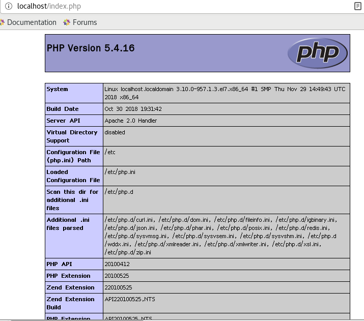
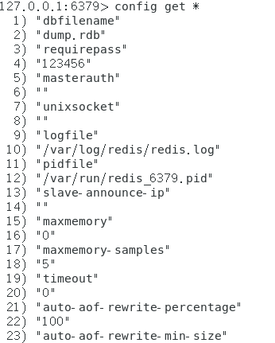
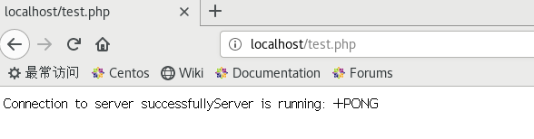

#### 突然发现自己的非关系型数据库的知识几近于无，因此就想学习一点这方面的知识
<!--more-->
1. NoSQL

    又称非关系型数据库。NoSQL有时也称作Not Only SQL的缩写，是对不同于传统的关系型数据库的数据库管理系统的统称。NoSQL用于超大规模数据的存储。这些类型的数据存储不需要固定的模式，无需多余操作就可以横向扩展。

    优点：高可扩展性，分布式计算，成本低，具有灵活的架构，半结构化数据，无复杂关系
2. Redis
    * 非关系型数据库中的一种，完全开源免费，是一个高性能的key-value数据库
    * 特点：
        Redis支持数据的持久化，可以将内存中的数据保存在磁盘中，重启的时候可以再次加载进行使用。
    
        Redis不仅仅支持简单的key-value类型的数据，同时还提供list，set，zset，hash等数据结构的存储。
    
        Redis支持数据的备份，即master-slave模式的数据备份。
    * 优势：

        - 性能高，读的速度为110000次/s，写的速度是81000次/s
        - 丰富的数据类型，支持 Strings, Lists, Hashes, Sets 及 Ordered Sets 数据类型操作。
        - 原子性，单个操作是原子性的。多个操作也支持事务，即原子性，通过MULTI和EXEC指令包起来。
        - 丰富的特性，支持 publish/subscribe, 通知, key 过期等等特性。
3. Linux下配置Redis环境（PHP）
    1. 首先需要一个Linux环境，我用的是虚拟机，系统是centos7
    2. 修改防火墙配置
        ```
        vim /etc/sysconfig/iptables
        //在里面写入需要开放的端口
        -A INPUT -m state --state NEW -m tcp -p tcp --dport 80 -j ACCEPT（允许Apache80端口通过防火墙） 
        -A INPUT -m state --state NEW -m tcp -p tcp --dport 3306 -j ACCEPT（允许PHP3306端口通过防火墙）
        -A INPUT -m state --state NEW -m tcp -p tcp --dport 6379 -j ACCEPT（允许redis6379端口通过防火墙）
        ```
        之后重启防火墙`systemctl restart firewalld.service `，使服务生效。
    3. 安装Apache：执行以下命令
        ```
        yum install httpd  //yum安装Apache
        systemctl start httpd.service  //启动httpd服务
        systemctl enable httpd.service //设置开机自启
        ```
    4. 安装PHP：执行以下命令
        ```
        yum install php  //安装PHP
        systemctl start php-fpm  //开启PHP服务
        cd /var/www/html   // 切换到www路径，写一下测试
        vim index.php    //这里随便起名
        //这里是测试用例
        <?php
        phpinfo();
        ?
        ```
        写完以后，确保Apache服务是开启的，可以执行`systemctl status httpd`这个语句来确定Apache的状态，如果是running，证明是开启的。然后去浏览器里输入localhost/index.php，如果出现以下的结果，证明安装成功。
        
    5. 安装Redis：执行以下命令
        ```
        yum install redis
        yum install epel-release
        yum install redis
        systemctl start redis
        systemctl status redis
        systemctl enable redis
        ```
    6. Redis配置,可以直接修改配置文件，也可以在命令行里修改。
        ```
        redis-cli -h 127.0.0.1 -p 6379  //redis端口号6379，本地登录
        //查看配置
        config get *    //查看所有配置
        //为redis设置密码
        config set requirepass 'password' 
        auth password
        config get requirepass
        ```
        设置完密码后，重新登陆。如果不输入密码，当你输入命令后，会提示报错。因此当你登录进去后，首先要输入`auth password`才能继续使用。当然，也可以在登录时直接输入密码，命令是`redis-cli -h 127.0.0.1 -p 6379 -a password`，这样登陆进去之后就可以直接使用。

        查看全部配置：
        
        
    7. php与redis
        * 首先，需要安装PHP扩展`yum install php-pecl-redis`
        * 然后，修改php配置文件
            ```
            vim /etc/php.ini   //编辑配置文件
            ```
            如果找不到php.ini,可以使用whereis命令，在配置文件最后，添加`extension=redis.so`,保存并退出。
        * 测试：去Apache目录下vim一个测试文件
            ```
            cd /var/www/html
            vim test.php
            <?php
            //连接本地的 Redis 服务
            $redis = new Redis();
            $redis->connect('127.0.0.1', 6379);
            $redis->auth('password');
            echo "Connection to server successfully";
                    //查看服务是否运行
            echo "Server is running: " . $redis->ping();
            ?>
            ```
            成功之后，会输出Connection to server successfullyServer is running: +PONG
            
            这样就代表我们能够使用PHP操作Redis了。
