#### phpdbg是一个PHP的SAPI模块，可以在不用修改代码和不影响性能的情况下控制PHP的运行环境
<!--more-->
#### phpdbg的目标是成为一个轻量级，强大，易用的PHP调试平台。可以在PHP5.4及以上版本使用，在PHP5.6及以上版本已经内置
#### 使用方法
以下面的代码为例：
```
<?php
function test($a,$b){
    $c = $a + $b;
    return $c;
}
$i = 1;
$j = 2;
echo test($i,$j),PHP_EOL;
$name = '白菜';
class TestClass{
    public function printSth($a){
        echo $a.'----';
    }
}
$test = new TestClass();
$test->printSth('123');
```

1. 如果想要加载要调试的脚本，只需执行exec命令即可，如下：
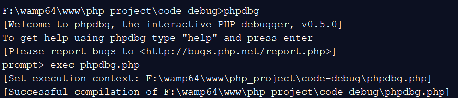
 显示successful即成功。当然我们也可以在启动的时候指定e参数：
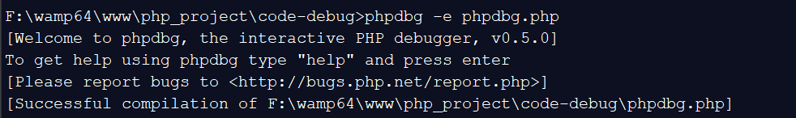
2. 设置断点
    * 按opline设置断点：这里所说的opline，就是以方法入口作为起点，当前所在代码的行号。在上面的示例中，第三行的'$c = $a + $b;'的opline就是1.
    
    
        执行：
    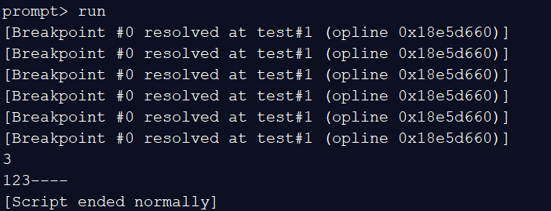可以看到断点执行情况
    * 按方法设置断点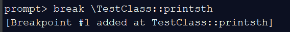
    * 按行数设置断点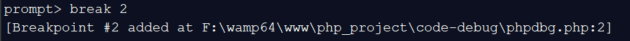
3. 查看断点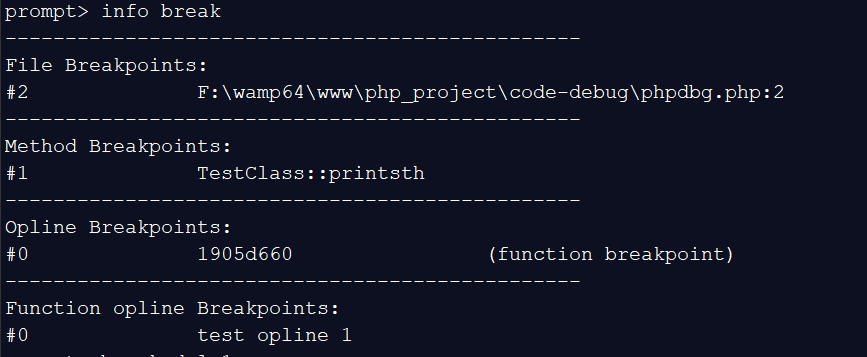
info break的显示结果中会把断点的类型也给显示出来。#后面的数字是断点号，我们可以根据断点号删除断点
4. 删除断点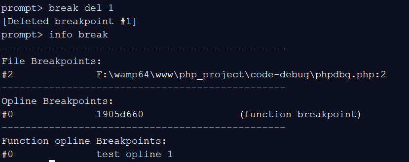
5. 单步执行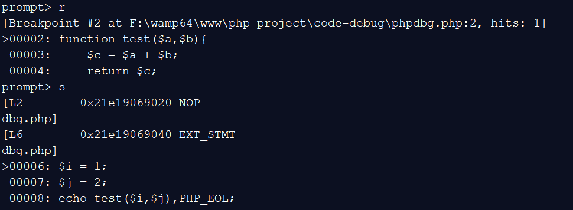
phpdbg的单步执行只有一个命令 step。是一行一行的执行代码。
6. 继续执行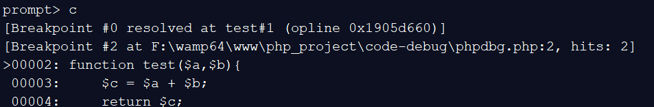continue继续执行代码，简写为c

7. 查看代码 

    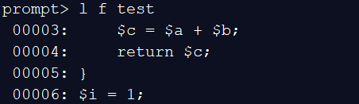
    
    list命令显示test函数的代码
8. 查看opcode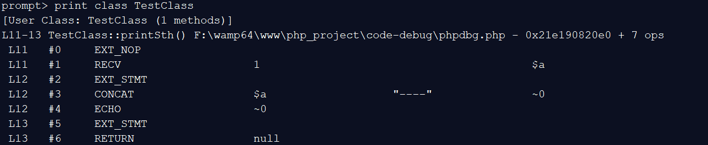print 命令查看opcode
