### 配置域名
1. 在c盘下Windows文件夹下的system32文件夹下drivers文件夹下的etc文件夹下的hosts文件添加一个配置
<!--more-->
```
127.0.0.1  www.tp5.com
```
如果不能修改的话，将文件复制到桌面修改，然后在粘贴回去就完事了。
<!--more-->
2. 因为我用的是wamp集成环境，所以配置要在httpd-vhosts.conf下配置：
```
#
<VirtualHost *:80>
	ServerName www.tp5.com
	DocumentRoot "f:/wamp/www/tp5/public"
	<Directory  "f:/wamp/www/tp5/public/">
		Options +Indexes +Includes +FollowSymLinks +MultiViews
		AllowOverride All
		Require local
	</Directory>
</VirtualHost>
```
如果用户用的的Apache，要修改Httpd.conf
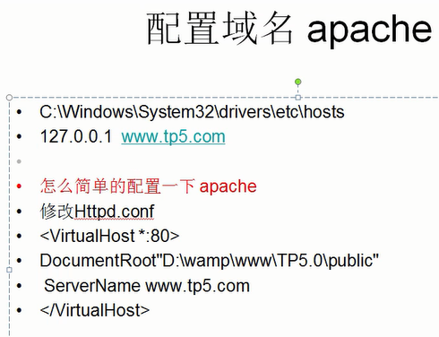
### 命名规范
1. 目录和文件
    * 目录使用小写+下划线
    * 类文件使用驼峰命名法，首字母大写，其他文件采用小写+下划线命名
    * 类名和类文件名保持一致，统一采用驼峰法命名
2. 函数和类，属性命名
    * 类的命名采用驼峰法，首字母大写。默认不加任何后缀
    * 函数的命名使用小写+下划线命名
    * 方法的命名使用驼峰法，首字母小写
    * 属性的命名使用驼峰法，首字母小写
### 目录结构
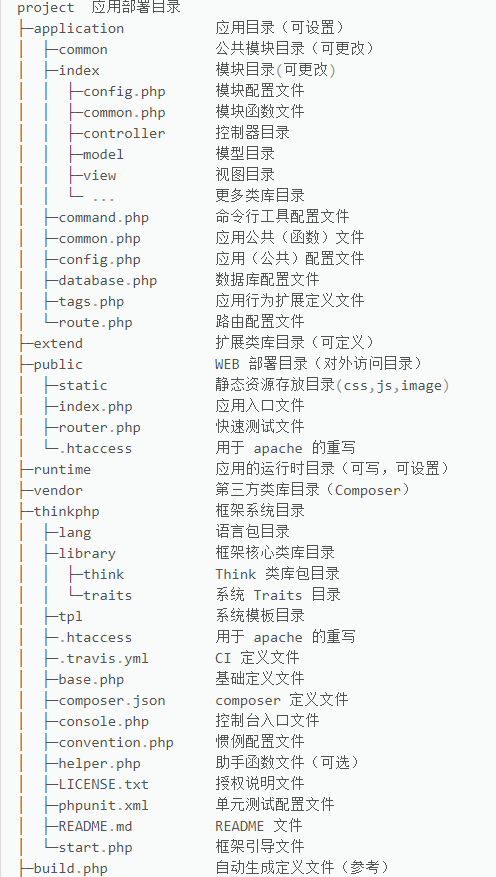

### url和路由
路由：通过用户请求的地址，根据地址的某种规则解析，然后分发到相应的模块相应的控制器地址。
1. 访问路径大小写的注意：
* TP5全部转换为小写
* 控制器首字母大写
* 驼峰式命名要加下划线，如果想区分大小写的话，可以在config.php里将url_convert改为false。
配置路由：在route.php里配置
URL生成
### 请求和响应
1. 详细内容请看tp5完全开发手册
* [请求与响应 https://www.kancloud.cn/manual/thinkphp5/158834](https://www.kancloud.cn/manual/thinkphp5/158834)
2. 页面跳转：可以直接指定路径跳转，也可以重定向跳转。
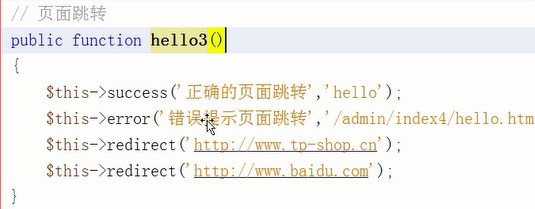
3. 总结一下
   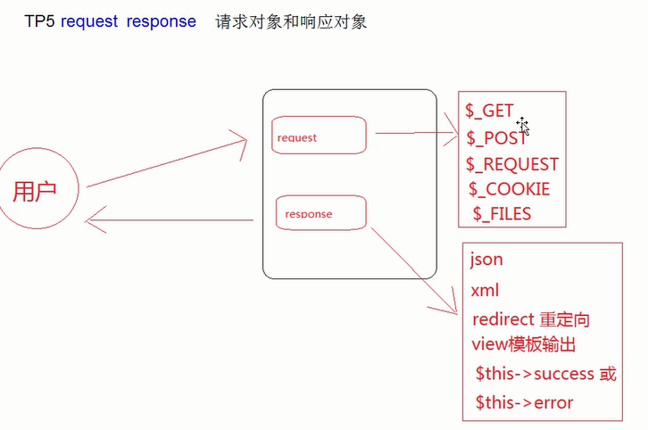
### 数据库基本操作
1. 数据库配置
	* 在database.php里配置
	```
	// 数据库类型
    'type'            => 'mysql',
    // 服务器地址
    'hostname'        => '127.0.0.1',
    // 数据库名
    'database'        => '你的数据库名',
    // 用户名
    'username'        => '你的用户名',
    // 密码
    'password'        => '你的密码',
    // 端口
    'hostport'        => '你的端口号',
    // 连接dsn
    'dsn'             => '',
    // 数据库连接参数
    'params'          => [],
    // 数据库编码默认采用utf8
    'charset'         => 'utf8',
    // 数据库表前缀
    'prefix'          => '数据库表的前缀',
    // 数据库调试模式
    'debug'           => true,
	```
	一定要确定好自己的配置，否则会出错出到让你心态爆炸的，不要问我怎么知道的！！！！！！！！！！
	* 如果要操作多数据库，只要在config.php里配置一个数组，数组里是以上的配置就好了。
2. query execute 原生态SQL语句 增删改查
	* 查询操作用query
	* 其他操作用execute
3. 多个数据库切换查询操作
	```
	Db::connect('db1')->query(查询语句)
	Db::connect('db2')->query(查询语句)
	```
4. 事务支持
	* 需要在数据库中设置表类型为InnoDB以支持事务，然后把需要执行的事务操作封装到闭包里面即可自动完成事务。用Db::transaction函数操作。
	* 手动控制事务的提交。首先启动事务（Db::startTrans()）,然后用try，catch来提交，回滚事务（Db::rollback()）。
### 模型和关联
    模型是一种对象-关系映射的封装，并且提供了简洁的ActiveRecord实现，一般来说，每个数据表会和一个模型对应。创建一个子类，类名跟数据表名相同（需要用驼峰命名法，会自己转换），继承Model父类。在调用的时候，会自动查询主键。
### 查询范围
1. scope + 查询范围名称  定义函数   
2. 全局查询范围，定义之后，会自动调用

### strstr函数
    搜索一个字符串在另一个字符串中的第一次出现，并返回字符串剩余的部分，对大小写敏感。
    ```
    查找 "Shanghai" 在 "I love Beijing!" 中的第一次出现，并返回字符串的剩余部分：

    <?php
    echo strstr("I love Beijing!","Beijing");
    ?>
    ```
### 输入与验证
简单来说就是表单操作，然后要用validate函数来验证，实现对数据库的操作。
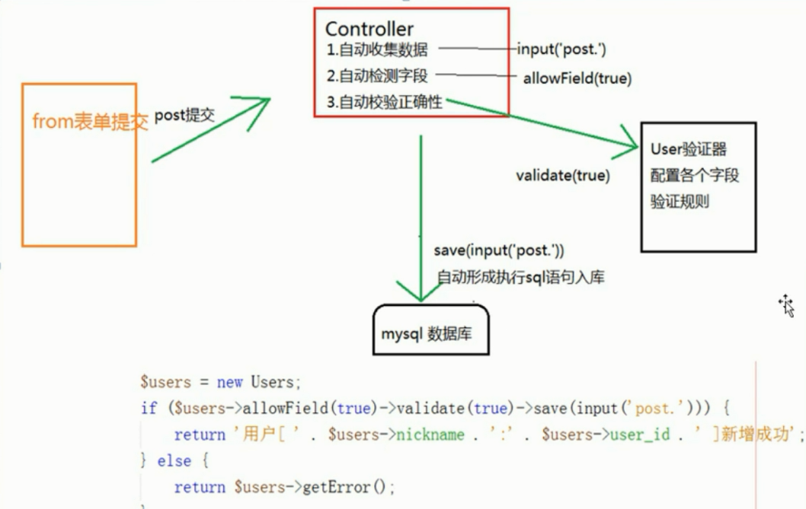

### 关联
一对一：has_one以及相对的belongs_to

多对多：has_many以及相对的belongs_to

一对多：belongs_to_many

### 视图与模板
1. volist标签
* 属性       
   * name(必须)：要输出的数据模板变量
   * id(必须)：循环变量
   * offset（可选）：要输出数据的offset
   * length（可选）：输出数据的长度
   * key（可选）：循环的key变量，默认值为i
   * mod（可选）：对key值取模，默认为2
   * empty（可选）：如果数据为空显示的字符串
2. 公共模板
* 模板定位
    ```
    'template'               => [
            // 模板引擎类型 支持 php think 支持扩展
            'type'         => 'Think',
            // 默认模板渲染规则 1 解析为小写+下划线 2 全部转换小写
            'auto_rule'    => 1,
            // 模板路径
            'view_path'    => '',
            // 模板后缀
            'view_suffix'  => 'html',
            // 模板文件名分隔符
            'view_depr'    => DS,
            // 模板引擎普通标签开始标记
            'tpl_begin'    => '{',
            // 模板引擎普通标签结束标记
            'tpl_end'      => '}',
            // 标签库标签开始标记
            'taglib_begin' => '{',
            // 标签库标签结束标记
            'taglib_end'   => '}',
        ],
    ```

* 模板布局

    ```
    'layout_on'=>true  //开启模板布局
    'layout_name'=>'layout'  //使用layout文件
    'layout_item'=>'{__CONTENT__}'
    
    ```

    图片显示：
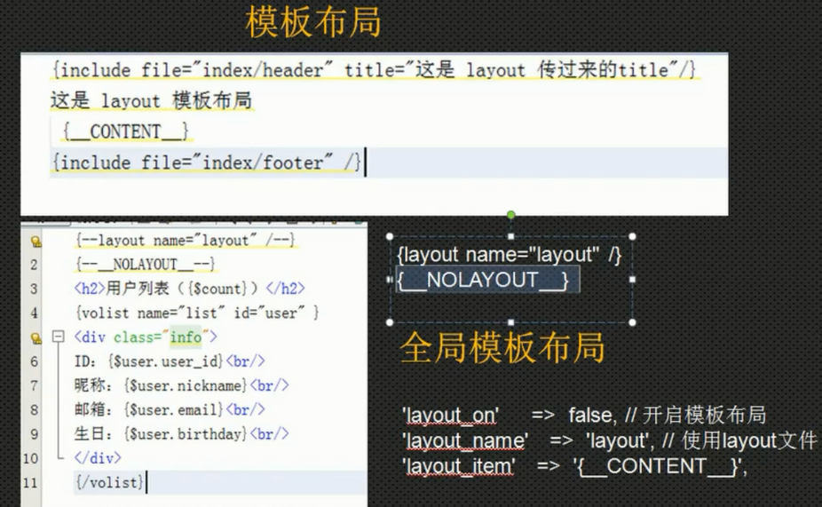
### 调试和日志
1. 页面trace(官方推荐)
* 修改配置，启动调试

    ```
    // 应用Trace
    'app_trace'              => true,
    'trace'                  => [
        // 内置Html Console 支持扩展
        'type' => 'Html',
    ```

    在显示页面时，浏览器底部会有调试信息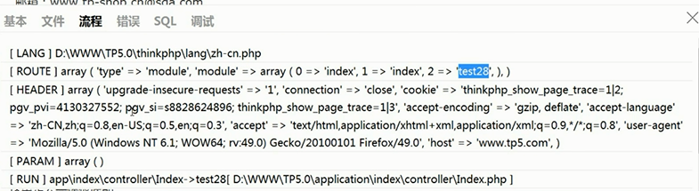
2. 异常页面
* 直接报错调试，显示错误信息
3. 断点调试
* dump调试输出
* halt变量调试中断并输出(打印之后就不会再打印)
* trace 控制台输出

4. 日志分析
* log常规日志，用于记录日志
* error错误，一般会导致程序的中止
* notice 警告，程序可以运行但是不够完美的错误
* info 信息，程序输出信息
* debug 调试，用于调试信息
* sql SQL语句，用于SQL记录，只在数据库的调试模式开启时有效

```
//在runtime下的log文件
Log::error('错误信息1');
Log::info('日志信息2');
trace('错误信息3'，'error');
trace('日志信息4'，'info');
```

5. 远程调试
### api调用（需要json返回）
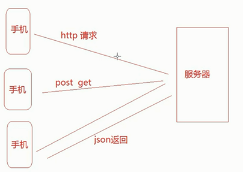
* 创建api模块
* 模拟提交测试（用php工具箱）
### 扩展
* 如果有些函数需要全栈共用，就要在application\common.php文件中自己定义。创建的类库存放于extend目录下面，在extend\org\文件名.php，跟项目有关系的类放在application\common\文件名.php。如果没有这些文件夹，需要自己创建。
* 驱动扩展
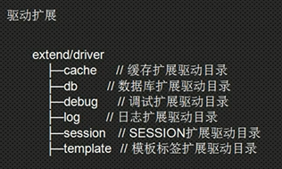
### session与cookie
1. session文件存放位置 
* php.ini session.save_path
2. 开启session
* session_start
3. tp5里session设置config.php

    ```
    'session'                => [
            'id'             => '',
            // SESSION_ID的提交变量,解决flash上传跨域
            'var_session_id' => '',
            // SESSION 前缀
            'prefix'         => 'think',
            // 驱动方式 支持redis memcache memcached
            'type'           => '',
            // 是否自动开启 SESSION
            'auto_start'     => true,
        ],

        session::set() //赋值当前作用域
        session::has() //判断
        session::get() //取值
        session::delete() //删除
        session::clear() //清除session
    ```

4. cookie

    ```
    'cookie'                 => [
            // cookie 名称前缀
            'prefix'    => '',
            // cookie 保存时间
            'expire'    => 0,
            // cookie 保存路径
            'path'      => '/',
            // cookie 有效域名
            'domain'    => '',
            //  cookie 启用安全传输
            'secure'    => false,
            // httponly设置
            'httponly'  => '',
            // 是否使用 setcookie
            'setcookie' => true,
        ],

        cookie::set()  //设置cookie
        cookie::delete() //删除
        cookie::clear() //清除cookie
    ```

支持数组，支持使用cookie类直接读取
### 验证码
安装composer，然后使用它安装验证码类库
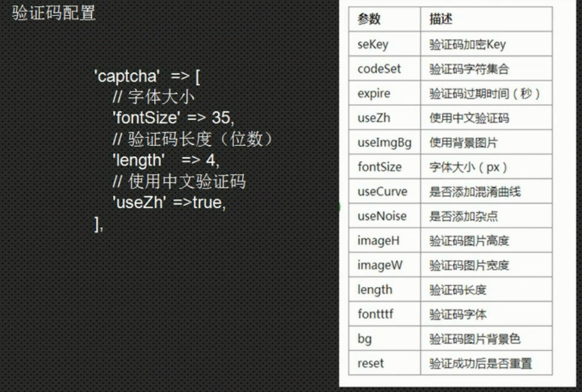
### 文件上传
1. 上传form表单的enctype属性一定要设置成multipart/form-data
2. 校验：用validate方法校验上传的是否是需要的文件
3. 上传
md5是表示用MD5方式命名，也可改为date，即根据上传时间命名。如果想要保持上传文件的原文件名，可以将rule('md5')改为$file.
4. 多文件上传
* 将单文件上传foreach循环遍历，变为多文件上传
### 图像处理
1. 安装图像处理类库
2. 图片读取 `Image::open($file)`

```
    //图片裁剪(宽度，高度，x坐标，y坐标)
    $image->crop(300,300,200,200);
    //缩略图(最大宽度，最大高度，裁剪类型)
    $image->thumb(150,150,Image::THUMB_CENTER);
    //垂直翻转
    $image->flip();
    //水平翻转
    $image->flip(Image::FLIP_Y);
    //图片旋转(顺时针旋转的度数)
    $image->rotate(30);
    //图片水印
    $image->water(ROOT_PATH.'图片名',Image::WATER_NORTHWEST,50)
    //文字水印(水印文字，字体文件路径，文字大小，文字颜色，文字写入位置，偏移量，文字倾斜角度)
    $image->text();
```

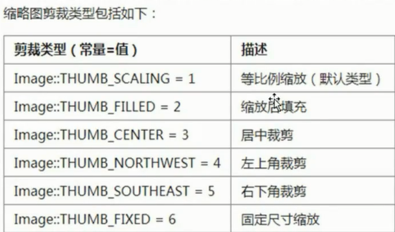
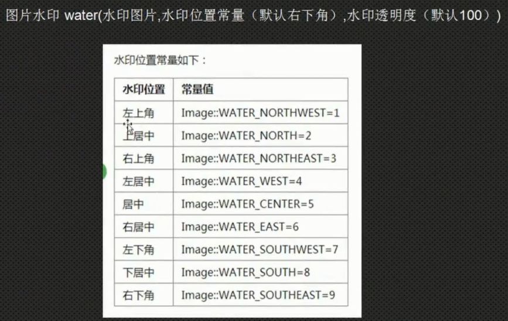
3. 图片保存 `$image->save()`
### tp5自带的方法
* 分页：paginate   需要在模板中使用：{$data->render()}
* tp5中url的写法
1. href="{:url('admin/index')}?Id={$data['Id']}" 
2. href="{:url('index/download',['Id'=>$data['Id']])}"
* validate验证
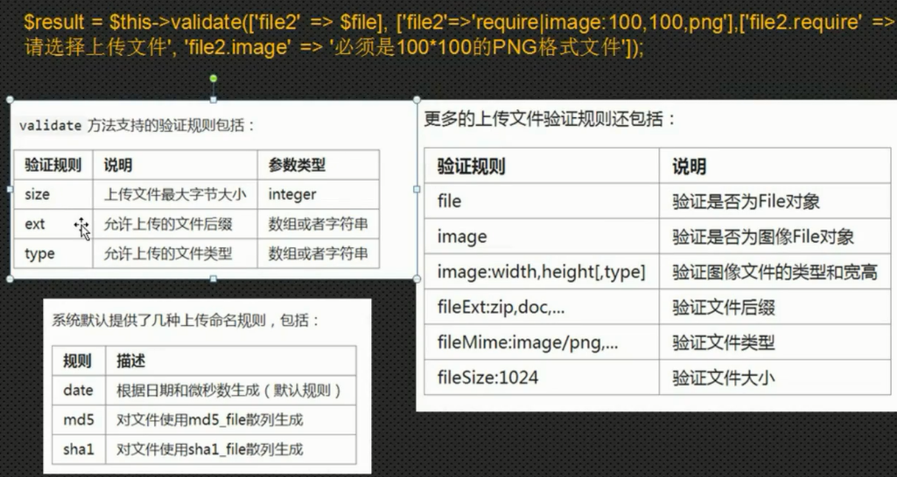
## 附tp5完全开发手册：[https://www.kancloud.cn/manual/thinkphp5/content](https://www.kancloud.cn/manual/thinkphp5/content)