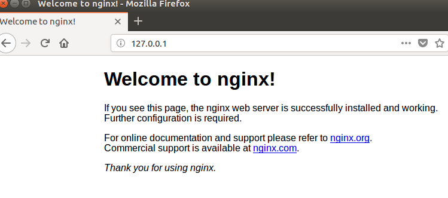
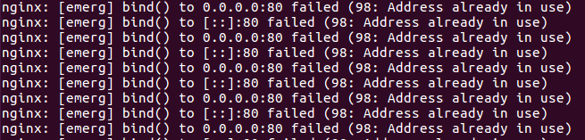
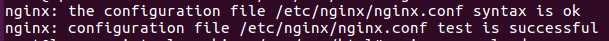
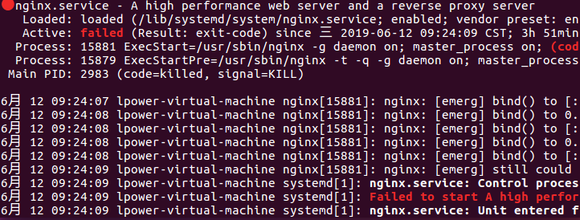
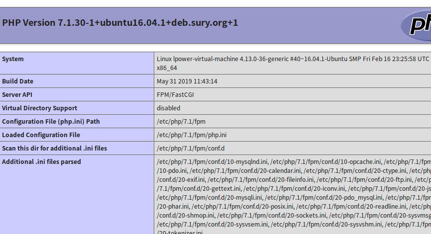

#### 记一次Linux下搭建lnmp环境走过的坑
<!--more-->
1. 更新源
`sudo apt-get update`
2. 安装nginx
    ```
    sudo apt-get install nginx
    sudo service nginx start  //开启nginx服务
    systemctl status nginx  //查看nignx状态
    ```
    在浏览器输入127.0.0.1，出现如下界面，说明已经安装成功
3. 安装php7.1与php7.1-fpm

    直接运行`sudo apt-get`命令安装PHP会报错，原因是 PHP7 等并不在 Ubuntu的软件库中，因此要使用 PPA ppa:ondrej/php 库，所以需要运行如下命令：
    ```
    sudo apt-add-repository ppa:ondrej/php
    sudo apt-get update
    sudo apt-get install php7.1 php7.1-fpm
    ```
    安装完成后运行`php -v`命令查看php版本，确定php安装完成
4. 安装MySQL及PHP-MySQL扩展
    ```
    apt-get install mysql-server mysql-client php7.1-mysql
    ```
    安装过程中会需要输入MySQL的密码，输入自己想要设置的密码即可。安装完成后，运行`systemctl start mysql`开启MySQL服务
5. Nginx 与 PHP-FPM集成
    * 修改nginx配置文件
    
        nginx配置文件在/etc/nginx/sites-available/default 配置文件中（网站根目录也在是这里更改）,nginx已经默认与php-fpm集成好了，只需修改以下配置即可
        ```
        root   /var/www/html    //网站默认根目录
        index index.php index.html index.htm index.nginx-debian.html;//默认文件
        location ~ \.php$ {
                    include snippets/fastcgi-php.conf;
            #       # With php7.0-cgi alone:
            #       fastcgi_pass 127.0.0.1:9000;
            #       # With php7.0-fpm:
                    fastcgi_pass unix:/run/php/php7.1-fpm.sock;
        }
        ```
        配置完成后，保存退出。运行`nginx -t`命令检测配置文件是否有错误。我在检测的时候遇到了一个错误这种情况是80端口被占用，此时我们可以输入`lsof -i :80`命令来查看80端口的pid，然后`kill pid号`将进程关闭，再运行`nginx -t`，如果出现
        
        
        证明配置完成，再重新载入nginx配置（`nginx -s reload`）
6. 完成搭建
    * 改完配置文件后，重新启动nginx服务`systemctl start nginx`,此时可能会报错，查看nginx状态`systemctl status nginx`，会发现出现下列情况  这个错误还是端口80被占用，用上述方法再修复一次即可。
    * 启动php-fpm服务 `systemctl start php7.1-fpm`
    * `sudo echo '<?php echo phpinfo();'  > /var/www/html/test.php`运行此命令，将test.php存放到网站根目录下，访问`127.0.0.1/test.php`，如果成功，会出现  .但是注意，这里还会有一个坑，访问这个页面之后可能会出现502的情况，如果出现502，应该就是nginx配置文件出错
        ```
        location ~ \.php$ {
                        include snippets/fastcgi-php.conf;
                #       # With php7.0-cgi alone:
                #       fastcgi_pass 127.0.0.1:9000;
                #       # With php7.0-fpm:
                        fastcgi_pass unix:/run/php/php7.1-fpm.sock;
            }
        ```  
        仔细看这个配置文件最后一行，php的版本一定要与自己系统里的php版本一样，如果是7.2，就要改为7.2，否则就会出现502错误。改完以后，重新载入配置，启动服务，在测试一遍，就会成功。 
