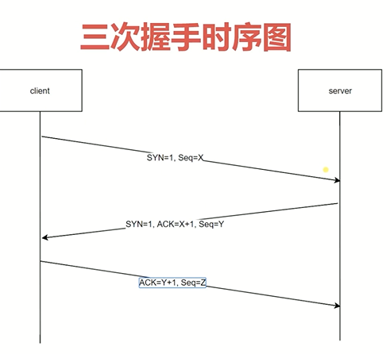
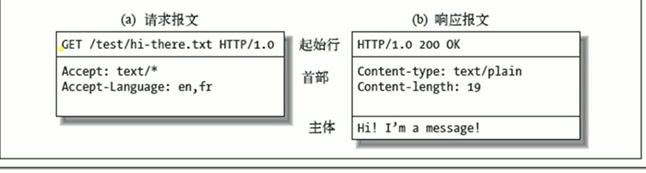

## http在学习网络的过程中是必不可少的，所以在这里整理了一些关于HTTP的知识点
<!--more-->
1. HTTP2与之前的版本的比较
    * 所有数据均以二进制传输
    * 同一个连接里面发送多个请求不再需要按照顺序来
    * 增加了头信息压缩以及推送(并行推送css,html等)等提高效率的功能
2. HTTP三次握手

    

    SYN:标志位   
    Seq 随机产生   
    回应：ACK = Seq+1
    * 客户端发给服务器一个信号(SYN=1,Seq=0)。服务器端收到后，回应给客户端(SYN=1,ACK=1,Seq=0),当客户端收到服务器端的信号后，再回复给客户端，告知自己收到消息(ACK=1,Seq=0)。三次握手完毕后，确认可以安全传输。
    * 功能：防止服务端开启一些无用的连接，减少服务器一些不必要的开销。

3. URI URL URN
    * URI Uniform Resource Identifier/统一资源标识符

        * 用来唯一标识互联网上的信息资源

        * 包含URL和URN
    * URL Uniform Resource Locator/统一资源定位器
        * https://www.baidu.com  此类格式的都叫做URL，还有ftp协议等等。
    * URN 永久统一资源定位符
        * 在资源移动之后还能被找到
4. http报文
    
    * 请求部分：
    ```
    首行第一部分     method  请求方法  get,post等
    首行第二部分     url（请求的地址）
    首行第三部分     协议版本
    ```
    * 响应报文：
    ```
    首行第一部分       协议版本
    首行第二部分        code 200表示正常
    首行第三部分        明文表示code的含义
    ```
    * http方法

        用来定义对于资源的操作   GET post等
    * HTTP CODE ,可以判断结果.
    * 定义服务器对请求的处理结果，各个区间的CODE有各自的意义
    ```
    100-199 代表请求已经被接受，需要继续处理  eg:100 Continue
    200-299 代表请求已成功被接收，理解并接受   eg:200 OK 202 accepted
    300-399 代表需要客户端采取进一步的操作才能完成请求，通常用来重定向 
    eg:307 Temporary Redirect
    在这种情况下，请求应该与另一个URI重复，但后续的请求应仍使用原始的URI。
    与302相反，当重新发出原始请求时，不允许更改请求方法。
    例如，应该使用另一个POST请求来重复POST请求。
    400-499  代表客户端看起来可能发生了错误   eg:403  forbidden 404 not found
    500-599  代表服务器错误  eg: 500   502 网关错误
    ```
5. CORS跨域请求的限制与解决
    * CORS
    1. CORS是一个W3C标准，全称是"跨域资源共享"（Cross-origin resource sharing）。

    2. 它允许浏览器向跨源服务器，发出XMLHttpRequest请求，从而克服了AJAX只能同源使用的限制。
    * 限制

        1. 浏览器同域请求，在浏览器这边发送的Ajax请求必须在同域里，如果跨域，需要服务器同意
        2. 请求头限制
    * 解决

        可以通过放入`Access-Control-Allow-Origin: '*'`来实现跨域('*' 代表任何服务都可以跨域   可以设置为一个特定的域名)

        在script,link,image标签里写路径，加载一些东西的时候，浏览器是允许跨域的
    
    * CORS预请求

        除GET,POST,HEAD三种方法 及三种Content-Type(text/plain,multipart/form-data,application/x-www-form-urlencoded)外，其他都需要预请求


6. cookie和session
    * cookie
    
        在服务端返回数据时，通过Set-Cookie这个head设置在浏览器里面，保存在浏览器里面的一个内容。
        
        下次请求会自动带上     
        
        键值对，可以设置多个
        
        有时效，如果没有设置时间，关闭浏览器后就会删除
        
        属性：
        max-age和expires设置时间

        Secure只在http的时候发送
        
        HttpOnly无法通过documents.cookie访问(防止CSRF注入)
    * session

        位于web服务器上，主要负责访问者与网站之间的交互
    
        关闭网站时会话结束
    
        无法永久保存数据
    * cookie与session的区别

        session比cookie更安全

        cookie在客户端，session在服务器上

        cookie能够保存的数据较小