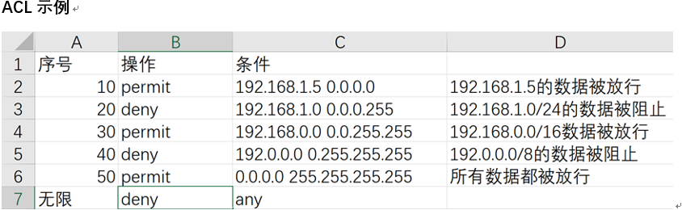
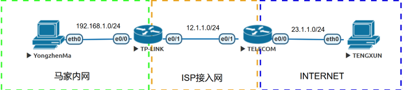
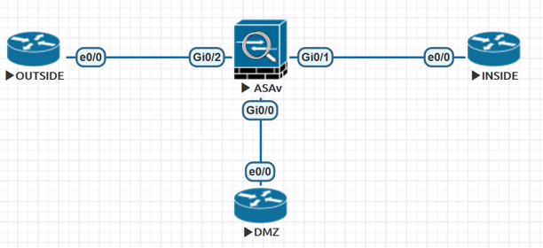
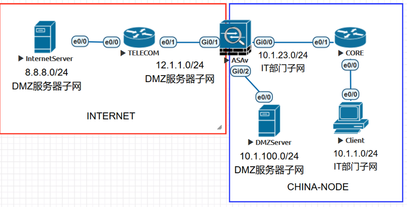
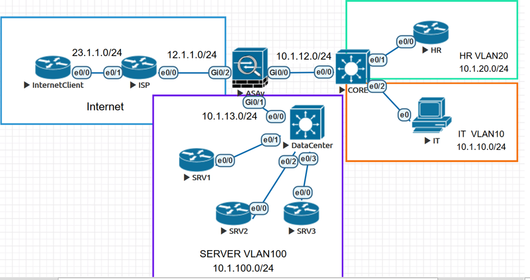

### 2019年第一篇博客，我大学生涯的第一次实训，在大连诺达，学了一些思科模拟器的使用和一点网络安全基础（防火墙）,使用的是思科的eve
<!--more-->
#### 一、交换机和MAC地址
1. 单工，半双工，全双工
* 单工：数据只能沿一个方向发送，另一个方向是无法发送数据的。
* 半双工：数据可以沿两个方向发送，但同一时间只可能有一台设备发送数据。
* 全双工：数据可以沿两个方向同时发送。
* TYPE的取值：0800代表IP协议  0806代表arp协议
#### 二、iOS软件操作
1. 路由器：
* 1）首先输入no     初始化配置对话
* 2） en                 进入特权模式
* 3）configuration terminal   进入全局配置模式
* 4）hostname xxx   修改主机名
2. IP地址
* 1）配置
    ```
    step1：进入要配置IP地址的接口。
    命令：全局配置模式下：interface +接口号
    step2：配置IP地址
    命令：接口子配置模式下：ip address IP地址 子网掩码
    示例：R1(config-if)#ip address 12.1.1.1 255.255.255.0
    step3：开启接口，因为接口模式情况下是关闭的，即使配置IP地址也无法正常工作，所以需要开启接口。
    命令：接口子配置模式下：no shutdown
    示例：R1(config-if)#no shutdown
    step4：exit退出接口子配置模式进入另一个接口。
    step5：检查IP地址配置
    ```
    命令：特权模式下：show ip interface brief显示接口的三层摘要信息。在除了执行模式外其它模式输入执行命令时，需要在命令前添加do 关键字。
    检查IP地址配置是否无误，使用ping命令，来检查一对直连接口的IP 。
* 2）分类
    * IP地址根据其使用的方式分为ABCDE5类。分类的依据是一个IP地址当中前4bit的取值情况，按照如下规则进行分类。
    ```
    A：0xxx      
    B：10xx
    C：110x
    D：1110    组播IP地址
    E：1111     保留科研用IP地址
    ```
    A类地址的范围为1~126。0为保留地址。127为本地环回地址。
    B类地址的范围为128~191。169.254为本地链路地址，DHCP获取地址失败时会使用该地址。
    C类地址的范围为192~223。
    本地广播地址：255.255.255.255（也就是32个1）
    * 网络位：标识主机所属的网络
    * 主机位：标识网络中的一台主机
* 3）封装与解封
    * IP首部
    ```
    版本（4bit）：描述IP协议版本。一般为4。
    IHL（4bit）：描述IP协议首部长度。
    ToS（8bit）：用于标记流量，用作QoS。
    总长度（16bit）：代表一个IP数据包的总长度。
    标识（16bit）：相同的标识代表分片数据包属于同一个源数据包。
    标志（3bit）：0（保留，恒为0）0（DF位，禁止分片位）0（MF更多分片位）
    片偏移（13bit）：当前分片的第一个bit与原始分片的第一个bit的相对位移。
    MTU：最大传输单元，默认情况下多为1500
    TTL（8bit）：当TTL为0时，该数据包将被丢弃。用于减缓产生路由环路后对网络的影响。
    协议（8bit）：用于指示IP报文的上层协议。（例：TCP 6，UDP 17，ICMP 1）
    首部校验和（16bit）：检查IP首部在传输过程当中的完整性。
    源IP地址（32bit）：源主机IP地址
    目的IP地址（32bit）：目的主机IP地址
    ```
#### 三、传输层（tcp，udp，arp，路由表）
1. telnet协议（远程管理协议）
    * 实验配置：
    ```
    PC配置
    Router(config)#hostname PC            //将路由器的主机名设置为PC
    PC(config)#int e0/0               //进入设备的e0/0接口子配置模式
    PC(config-if)#ip address 12.1.1.1 255.255.255.0     //设置e0/0接口的IP地址为12.1.1.1/24
    PC(config-if)#no sh                        //开启e0/0接口
    PC(config)#no ip routing              //关闭路由器的路由功能
    PC(config)#ip default-gateway 12.1.1.2       //设置路由器的默认网关
    （备注：用路由器模拟PC的时候，必须关闭路由器的路由功能并为它设置默认网关。因为一台路由器收到一个目的地址未知的数据包，就会将它丢弃。而主机收到一个目的地址未知的数据包，会把它交给自己的网关）
    路由器的配置
    Router(config)#hostname ROUTER       //将路由器的主机名设定为ROUTER
    ROUTER(config)#int e0/0                 //进入e0/0接口的子配置模式
    ROUTER(config-if)#ip address 12.1.1.2 255.255.255.0 //设置e0/0接口的IP地址为12.1.1.2/24
    ROUTER(config-if)#no sh            //开启e0/0接口
    ROUTER(config)#line vty 0 4           //开启虚拟终端线路0到4共5条
    ROUTER(config-line)#transport input telnet      //限制入方向只能通过TELNET进行连接
    ROUTER(config-line)#password cisco123           //配置线路密码
    ROUTER(config-line)#login           //开启线路下密码认证功能
    验证实验效果
    PC>telnet 12.1.1.2        //使用telnet协议连接12.1.1.2主机，默认端口号23。
    ```
2. 路由表
    * 查看路由器的路由表：`show ip route`
    ```
    C        10.1.10.0/24 is directly connected, Ethernet0/0
    L        10.1.10.254/32 is directly connected, Ethernet0/0
    C        10.1.20.0/24 is directly connected, Ethernet0/1
    L        10.1.20.254/32 is directly connected, Ethernet0/1
    ```
    * 路由表中的每个路由条目，以一个网络地址作为主项。
    * 最前面的代码，一般是一个大写字母，代表一个路由表项的来源，常见来源：
	```
    C	直连路由
	L	本地路由
	D	EIGRP路由
	R	RIP路由
	S	静态路由
	O	OSPF路由
    ```
    * 一条路由可能在最后带有一个出接口。代表去往该网络需要将数据从出接口转发出去。有些路由没有出接口。没有出接口的路由一定会带有下一跳路由器信息，根据该信息可以进行路由的递归查询。
    * 一条路由可能在最后带有一个下一跳，代表去网该网络需要将数据发往哪个主机。
    * 一条路由（除了直连），一定会带有一个方括号，里面包含一对儿数字，其中前面的数字为AD（管理距离）后面的数字叫Metric(度量)。
    * 管理距离代表路由器对某种路由来源的信任程度。越小越好。常见管理距离，直连路由为0，静态路由默认为1，EIGRP为90，OSPF为110，RIP为120。管理距离越小，路由器越信任某种路由。
    * 度量代表路由协议通过何种方式计算到达目标网络的距离。也是越小越好。常见的度量标准有带宽（OSPF），跳数（RIP）和综合度量值（EIGRP）。目前的情况来看带宽是对数据传输能力影响最大的参数，所以推荐使用以带宽作为度量标准的路由协议（OSPF和ISIS和EIGRP）。
3. arp（地址解析协议）
* 1）0x0806对应ARP协议
* 2）ARP请求报文中的关键字段：
    * 源协议地址：发送主机的IP地址
    * 目的协议地址：目标主机的IP地址
    * 源硬件地址：发送主机的MAC地址
    * 目的硬件地址：00-00-00-00-00-00
    
    如果主机收到一个ARP请求，其中的目的协议地址是自己的IP地址，则他会向发来ARP请求的主机发送ARP回复。ARP回复是单播发送的

#### 四、路由基础
1. 静态路由
* 静态路由配置

    `R1(config)#ip route 10.1.2.0 255.255.255.0 12.1.1.2`

    配置一条到达10.1.2.0/24的路由，下一跳路由器接口IP地址为12.1.1.2。

* 配置静态路由一定要注意，下一跳接口地址必须可达。否则该静态路由不会装载进路由表。
* 配置静态路由一定要注意单向路由问题。一个单向路由是没有意义的
2. 默认路由

    `R1(config)#ip route 0.0.0.0 0.0.0.0 12.1.1.2`
    配置一条指向12.1.1.2的静态默认路由。
    
    默认路由是一种特殊的路由，它的前缀长度为0。所以默认路由可以被理解为描述一个最大的网络的路由，该网络可以包含任何一个IP网络。在末节路由器上常常配置默认路由来减少路由配置的复杂度。只要拥有任何一条明细路由，数据便不会匹配默认路由进行转发，这是由于路由表拥有最长子网掩码匹配的特性。任何明细路由子网掩码长度都会比默认路由的0更长一些，所以在有明细路由的情况下，数据不会匹配默认路由进行发送。
#### 五、icmp（互联网控制协议）
* IP协议号 1
    * 校验和与IP和TCP/UDP校验和一样用于检查数据的完整性。
    * 类型用于表明该ICMP报文属于什么类型。
    * 代码用于表明该ICMP报文属于某种类型的子类型。
* 大部分ICMP类型的报文我们目前已经停止使用了。现在还在频繁使用的ICMP类型有：
1. ICMP 类型8：回显请求。PING命令用于控制一台设备发送一个回显请求到某一个特定主机。收到回显请求的主机必须用回显应答进行响应。如果对端主机无法在规定时间内对回显请求进行响应，通常说明本主机与目标主机存在IP连通性故障。
2. ICMP类型0：回显应答。在收到某主机发送过来的回显请求后，必须用回显应答对对端主机进行响应。这说明对端主机正在测试与本主机之间的IP连通性。
3. ICMP类型3：差错报告报文。当一个主机由于某种原因丢弃了一个IP数据包后，会使用差错报告报文通知该数据包的源IP地址。根据不同的丢包原因，设定不同的CODE。常见丢包原因有：主机不可达，网络不可达，端口不可达等。
### 六、vlan（虚拟局域网）
1. 配置
    ```
    VLAN配置命令
    Switch(config)#vlan 10
    创建一个VLAN号为10的VLAN
    Switch(config-vlan)#name HR
    将某个VLAN的名字改为HR
    Switch(config-if)#switchport mode access
    将该接口的模式配置为access
    Switch(config-if)#switchport access vlan 10
    将该接口分配到VLAN10中
    ```
2. trunk
    ```
    配置命令：
    SW1(config-if)#switchport trunk encapsulation dot1q
    将接口的Trunk封装修改为802.1q
    SW1(config-if)#switchport mode trunk
    将接口的模式修改为Trunk
    SW1#show interfaces trunk
    查看一台交换机接口的trunk情况
    ```
3. vtp
    ```
    VTP基本配置
    SW1(config)#vtp mode server
    将交换机配置为VTP服务器
    SW1(config)#vtp mode client
    将交换机配置为VTP客户端
    SW1(config)#vtp mode transparent
    将交换机配置为VTP透明模式
    SW1(config)#vtp domain CCNA
    配置VTP域名为CCNA
    ```
#### 七、DHCP（动态主机配置协议）
1. DHCP分4次握手从服务器获取一个IP地址。
    ```
    1	客户端发送一个DISCOVER报文。（广播）
    2	服务器回应一个OFFER报文。（单播）
    3	客户端发送一个REQUEST报文。（广播）
    4	服务器回应一个ACK报文。（单播）
    ```
2. 4次握手之后，IP地址被正常的分配给客户端使用。
    ```
    ip dhcp pool VLAN10
    network 10.1.10.0 255.255.255.0
    default-router 10.1.10.254 
    ip dhcp pool VLAN20
    network 10.1.20.0 255.255.255.0
    default-router 10.1.20.254 
    ip dhcp pool VLAN30
    network 10.1.30.0 255.255.255.0
    default-router 10.1.30.254
    ```
### 安全方向
#### 八、ACL-访问控制列表
1. 概念

    访问控制列表是一种工具。顾名思义，它是一个列表。该列表有非常广泛的用途是各个厂商的安全设备或安全方案中的一个基本组件。该列表最初的作用在于控制访问，后来根据不同的应用场景，发展出不同的作用并衍生出各种其他的策略工具。
2. 基本操作

    ACL是一系列包含了permit或deny操作以及对应的条件的有序语句。整个ACL的工作过程如下：自顶向下对每条ACL语句进行评估，一旦发现条件匹配的情况则应用相对应的操作并停止继续向下匹配后续语句。所谓的顶和下是通过ACL的序号来决定的。序号越小，越优先匹配，序号越大匹配的顺序越靠后。

    所有ACL的末尾，都存在一个deny any的ACL语句。它的序号相当于无限大，也就是说任何用户定义的ACL都将优先于它进行匹配，也就是说如果一个数据没有被任何用户定义的ACL匹配，则它一定会被末尾的deny any语句匹配，并且流量会被拒绝。一方面默认的deny any操作体现了安全策略的基本原则，另一方面要注意，在编辑一个黑名单时，一定要在整个ACL的末尾，明确的permit any。否则，一个所有操作均为deny的ACL是没有实际意义的。
    
3. 分类
    * 标准ACL：只能以数据的源IP地址作为条件匹配流量。
    * 扩展ACL：可以以数据的源IP，目的IP以及其它一些三层和四层报文内容作为条件匹配流量。我们比较常用的是扩展ACL。
4. 配置
    ACL配置：
    ```
    R3(config)#access-list 1 deny   10.1.3.0 0.0.0.255     
    //定义一个编号的标准ACL，拒绝10.1.3.0/24为源的数据
    R3(config)#access-list 1 permit any
    //定义一个编号的标准ACL，放行所有流量
    R3(config-if)#ip access-group 1 out 
    //将编号ACL 1 调用在该接口的出方向上（注意配置模式）
    R3#show ip access-lists
    //检查配置的ACL以及命中情况。
    ```
    命名的扩展ACL配置：
    ```
    R3(config)#ip access-list extended DENYHR2SRV
    //配置一个名为DENYHR2SRV的扩展ACL
    R3(config-ext-nacl)# deny ip 10.1.2.0 0.0.0.255 10.1.100.0 0.0.0.255
    //拒绝从10.1.2.0/24去往10.1.100.0/24的所有IP流量
    R3(config-ext-nacl)# permit ip any any
    //放行所有其它流量
    ```
#### 九、NAT（网络地址转换）
1. 由来

    IPv4地址资源十分有限，总数只要43亿个左右，而且有大量地址是保留的无法直接分配给主机使用。随着互联网以及物联网的不断发展，接入到互联网中的设备数量越来越多。每一个需要在互联网上通信的设备都需要一个IP地址才能正常工作。私有IP地址的使用不受任何限制，也无需向IANA申请，但私有IP地址在Internet上是不被路由的，因为它破坏了IP地址唯一标识一台互联网主机的特点。在这种情况下，我们想要正常使用互联网资源，需要借助NAT技术。
2. 静态nat配置
* 问题:配置静态NAT。马同学家里有运营商分配的合法IP地址12.1.1.1和12.1.1.3。12.1.1.1被配置在TP-LINK路由器的公网接口e0/1上。现在要求配置静态NAT，在内网主机192.168.1.128访问公网时，将他的源IP地址转换为12.1.1.3。（注意配置默认路由）。

* 配置
    ```
    TPLINK(config)#ip route 0.0.0.0 0.0.0.0 12.1.1.2
    //配置一条下一跳指向12.1.1.2的默认路由。注意，如果不添加此默认路由，则网关路由器没有到达目的主机的路由会丢弃数据包。但添加去往目的主机的明细路由并不可取，因为目的主机模拟互联网主机，实际上互联网主机的数量会非常庞大，不可能每一个网络的路由都配置在网关路由器上，所以必须使用默认路由。
    TPLINK(config)#ip nat inside source static 192.168.1.128 12.1.1.3
    //配置内部源转换静态NAT。将内部本地地址192.168.1.128转换为12.1.1.3。
    interface Ethernet0/0
    ip address 192.168.1.1 255.255.255.0
    ip nat inside
    interface Ethernet0/1
    ip address 12.1.1.1 255.255.255.0
    ip nat outside
    //配置接口的IP地址以及NAT方向。注意方向不要写反。且必须配置
    检查NAT的命令：
    TPLINK#show ip nat statistics
    //查看NAT的统计信息，包括配置的内部和外部NAT接口以及NAT的命中情况
    TPLINK#show ip nat translations
    //查看NAT转换表，查看已经配置的NAT的转换情况
    ```
3. 地址类型
    * 所有Inside的地址，都是属于你内部设备的地址。
    * 所有Outside的地址，都是不属于你内部设备的地址。
    * 所有Local地址，一般是私有IP地址。
    * 所有Global地址，一般是公有IP地址。
    * Inside Local Address:内部主机使用的私有IP地址。
    * Inside Global Address:内部主机访问外部网络，将私有IP地址换成的共有IP地址。
    * Outside Local Address:外部主机访问内部网络，为其分配的私有IP地址。
    * Outside Global Address:外部主机的公有IP地址。
4. 类型
* 静态NAT：内部本地地址与内部全局地址的一一对应。每个内部本地地址访问外部网络的时候，需要一个单独的内部全局地址。
* 动态NAT：内部本地地址数量多余可用的内部全局地址。所有内部全局地址被放入一个NAT地址池。在内部主机需要访问外部网络的时候，从地址池中获取一个内部全局地址并进行NAT，如果地址池空了，则内部主机无法进行NAT。
* PAT：端口地址转换，在转换三层地址的同时，对四层的端口号也进行转换，从而支持一个内部全局地址对应多个内部主机。

    PAT基本配置
    ```
    TPLINK(config)#access-list 1 permit 192.168.1.0 0.0.0.255
    //配置一个ACL，匹配NAT的感兴趣流量，本例中，感兴趣流量是源IP地址为192.168.1.0/24的流量。
    TPLINK(config)#ip nat inside source list 1 interface Ethernet0/1 overload
    //配置一个内部源转换，对ACL1匹配的感兴趣流进行地址转换，将源地址转换为接口E0/1的IP地址，进行超载转换允许多个内部主机同时通过一个内部全局地址访问公网。
    ```
#### 十、简易密码学
1. 特点
    * 机密性：信息不能被非授权的第三方所读取和理解。
	* 数据完整性：信息不能被有意或无意的篡改或破坏。
	* 抗抵赖：不能否认曾经发送过的某些信息或执行过的某些操作。
	* 源认证：对于数据真实的源进行的识别。
	* 反重放：防止重复接收看似合法的数据的副本。
2. 散列算法
    * 例如MD5加密，哈希算法（SHA）
3. HMAC算法
    * 是基于HASH的消息认证代码，使用一个预共享密钥连同数据一起计算散列值。
4. 加密技术
    * 对称加密算法
    * 非对称加密算法
#### 十一、ASA防火墙基础
1. 防火墙
    1. 常见分区
        * 公共区域：一般指Internet、公共网络、菲私有网络、不受信任、不受保护。
        * DMZ区域：放置企业的公网服务器。
        * 内部区域：一般指企业内网。
    2. 防火墙在各个分区之间强制执行访问控制策略，如果一个区域被攻陷，防止攻击蔓延到另一个区域。
    3. 功能
        * 包过滤技术
        * 状态检测技术（节省资源、相对较安全）
        * 应用检测功能（AIC）
    4. 代理服务器：是客户端和服务器的一个中转站
    5. IPS与IDS：入侵防御系统和入侵检测系统，与防火墙类似。IPS可以采取阻断的动作，IDS可以向管理员发出警报。
2. ASA配置
    1. 接口配置
        * 接口IP地址：配置防火墙接口的IP地址
        * 接口的安全等级：防火墙接口必须有一个1-100的安全级别。通常接口连接到的区域受信任程度越高，该级别就越高
        * 接口的名字：防火墙接口必须有一个名字，在很多防火墙特性配置的时候，只能引用防火墙的接口名进行配置
        * 开启接口： no shutdown
    2. 默认访问控制策略：防火墙默认约需所有出站流量，拒绝所有入站流量。
        * 出站流量：当流量从一个高安全级别接口始发，去往一个低安全级别接口时，被认为是出站流量
        * 入站流量：当流量从一个低安全级别接口始发，去往一个高安全级别接口时，被认为是入站流量
    3. 防火墙基本配置
        
        * ASA配置
        ```
        interface GigabitEthernet0/0
            nameif DMZ
            security-level 50
            ip address 24.1.1.2 255.255.255.0 
        interface GigabitEthernet0/1
            nameif INSIDE
            security-level 100
            ip address 23.1.1.2 255.255.255.0 
        interface GigabitEthernet0/2
            nameif OUTSIDE
            security-level 0
            ip address 12.1.1.2 255.255.255.0
        //给每个接口配置了IP地址，接口名以及安全级别。
        policy-map global_policy
            class inspection_default
            inspect icmp
        //为默认全局策略的默认检测类开启ICMP检测。

        ```
        * 路由器开启telnet服务
        ```
        line vty 0 4
            login local
            transport input telnet
            username name(主机名) password password(密码)
        ```
3. ASA网络目标配置
    1. 网络目标是一种预定义的元素。分为三种类型，分别是主机(描述一台主机)，范围(描述从某IP地址到某IP地址的一组主机)，子网(描述一个子网的所有主机)。
    2. 配置
    
        1. 第一部分：按照图中所示配置所有设备的IP地址。正确配置模拟终端设备的路由器（关路由功能，设默认网关，配置IP地址并开启相应服务）。
            * 配置内网路由：在ASA和CORE之间配置动态路由协议
            * 配置公网路由：在CORE和ASA上配置指向电信的默认路由
            * 配置自动NAT:实现内网客户端访问公网服务器
            * 防火墙接口配置
            ```
            interface GigabitEthernet0/0
            nameif INSIDE
            security-level 100
            ip address 10.1.23.2 255.255.255.0 
            interface GigabitEthernet0/1
            nameif OUTSIDE
            security-level 0
            ip address 12.1.1.2 255.255.255.0 
            interface GigabitEthernet0/2
            nameif DMZ
            security-level 50
            ip address 10.1.100.254 255.255.255.0 
            ```
            * 防火墙动态路由配置
            ```
            router rigrp 1
            network 10.1.12.2 255.255.255.255
            network 10.1.100.254 255.255.255.255
            //开启了eigrp进程1，精确宣告了两个内网接口
            ```
            * 发布防火墙静态路由配置
            ```
            route OUTSIDE 0.0.0.0 0.0.0.0 12.1.1.1
            //配置了静态的默认路由指向TELECOM
            ```
            * 防火墙自动NAT配置
            ```
            object network ITSUBNET
            subnet 10.1.1.0 255.255.255.0
            nat(INSIIDE,OUTSIDE) dynamic interface
            //配置网络目标NAT（自动NAT），注意缩进。配置从10.1.1.0/24子网发起的流量，从INSIDE接口进入防火墙，从OUTSIDE接口离开防火墙。这些流量将源IP地址转化为接口OUTSIDE的IP地址。
            ```
        2. 第二部分：要求DMZServer开启HTTP服务，配置自动NAT和严格ACL允许公网主机访问DMZServerHTTP服务。
            * 配置自动NAT
            ```
            object network DMZSERVER1
            host 10.1.100.1
            nat(DMZ,OUTSIDE) static 12.1.1.100
            //将主机10.1.100.1进行静态NAT转换，转换后的地址为12.1.1.100
            ```
            * 配置ACL放行OUTSIDE到DMZ的合法流量
            ```
            access-list FORDMZSRV extended permit tcp any host   10.1.100.1 eq www
            //配置一个叫做FORDMZSRV的ACL，允许任何主机法网10.1.100.1的http流量。注意在这个位置写的IP地址和端口号是服务器的真实IP地址和端口号。
            access-group FORDMZSRV in interface OUTSIDE
            //将FORDMZSRV 调用在OUTSIDE接口的入方向上，放行公网主机访问内网服务器的首包。
             ```
    3. SSH(安全外壳协议):SSH和TELNET一样都可用于远程访问目标主机的CLI，SSH较安全。SSH使用TCP端口22作为目的
    4. 综合实验
    
        ##### 实验需求：配置防火墙，实现内网主机可以访问公网的HTTP服务。公网客户端可以访问内网的DMZ服务器的HTTP和SSH服务。要求在防火墙上配置适当的自动NAT策略和严格ACL来完成这个需求。
        1. 交换机配置各个VLAN以及各VLAN的SVI接口。交换机连接防火墙的接口使用RSI。
        2.	配置IP地址。（主机ping直连检查IP连通性）
        3.	配置内网路由（用EIGRP来实现。注意在ASA上连接ISP的接口不要运行EIGRP）
        4.	配置默认路由。（三层交换机和防火墙都需要默认路由来确保公网连通性）
        5.	配置ACL放行合法流量。（应用在出接口的入方向，ACL必须精确）。
        6.	配置自动NAT。（为HR和IT配置动态PAT，让他们能够访问公网，为DMZ服务器配置静态端口映射，让公网能够访问他们）。
        * 实验解答
        1. 核心配置
        ```
        object network SRV1
         host 10.1.100.1
        object network SRV2
         host 10.1.100.2
        object network SRV3
         host 10.1.100.3
        object network IT
         subnet 10.1.10.0 255.255.255.0
        object network HR
         subnet 10.1.20.0 255.255.255.0
        object service HTTP
         service tcp destination eq www 
        object service TELNET
         service tcp destination eq telnet
        object-group network SRVCluster
         network-object object SRV1
         network-object object SRV2
         network-object object SRV3
        object-group network SRVUser
         network-object object IT
         network-object object HR
        object-group service SRVService
         service-object object HTTP 
         service-object object TELNET
        配置并调用ACL：
        access-list ININSIDE extended permit object-group SRVService object-group SRVUser object-group SRVCluster
        access-group ININSIDE in interface INSIDE
        ```
        2. ssh配置
        ```
        SRV1(config)#hostname SRV1
        SRV1(config)#ip domain-name zbh.com
        //配置主机名和域名。主机名和域名对RSA密钥并无影响但RSA生成密钥需要这两个参数作为密钥标签。所以在生成RSA密钥对之前必须先配置主机名和域名。
        SRV1(config)#crypto key generate rsa modulus 1024
        //生成一个以1024为素模的RSA密钥对，模数越大，RSA密钥长度越长，强度越高
        SRV1(config)#ip ssh version 2
        //开启SSH版本2，SSH版本1的连接会被拒绝。推荐使用SSHv2
        SRV1(config)#line vty 0 4
        login local
         transport input ssh
        //开启vty线路，并允许在入向传输时使用SSH协议，注意这里没有包括telnet关键字，所以设备当前无法通过telnet进行远程管理。
        SRV1(config)#username zbh password cisco123
        //配置本地用户账户数据库用于对SSH远程连接进行身份认证
        HR#ssh -l zbh 10.1.100.1
        //以用户名zbh对10.1.100.1发起一个SSH远程访问。注意-l参数后面需要空格再填写用户名。
        ```