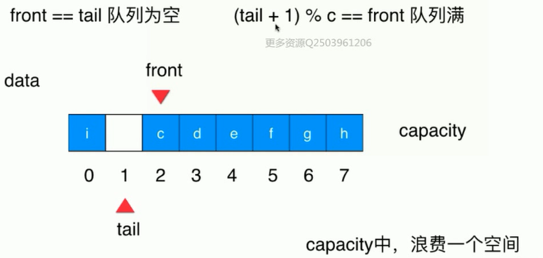
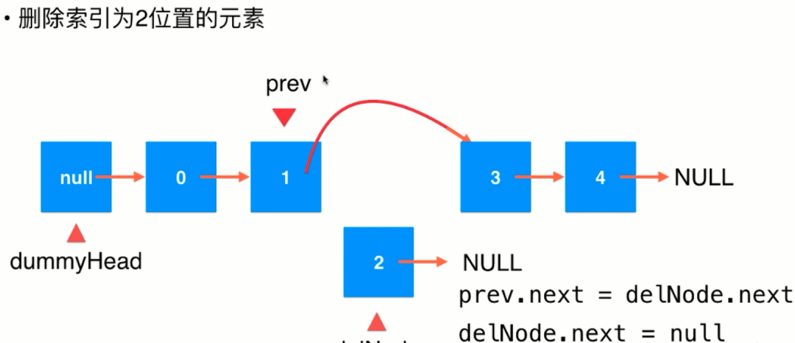
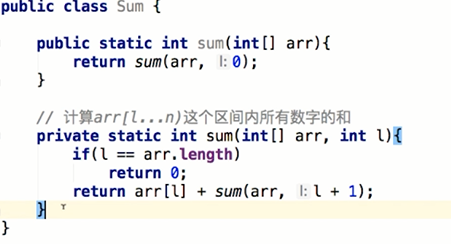

### 数组
<!--more-->
1. 泛型：使数据结构可以放置除boolean,byte,char,short,int,long,float,double这八种基础数据类型以外所有数据类型，如果想放置这八种基本类型，可以用对应的包装类。 在声明类的时候，在类名后加<类型>。下面要实例化数组的时候，要强制转换。例如：
    ```
    public class Array<E>{
        private E[] data;
        public Array(int cap){
            data = (E[]) new Object[cap];
        }
    }
    ```
2. 简单的时间复杂度分析
    * 大O 描述的是算法的运行时间和输入数据之间的关系，分析时忽略常数。
    * O(n)翻译过来应该是渐进时间复杂度，它描述的是当n趋于无穷的情况。
    * 严格计算需要一些概率论知识。
    * 均摊复杂度：将复杂度较高的算法和其他操作放在一起分析复杂度。这个复杂度较高的的算法复杂度将会均摊到其他的操作中。
    * 复杂度震荡：存在某种情况，刚刚进行了一次数组的删除操作，缩容了一次数组，此时数组元素个数正好等于数组的容量，后面又对数组进行了一次添加操作，就会又要给数组进行一次扩容，这样整个算法的复杂度就会上升，这就是所谓的复杂度震荡。
    * 解决复杂度震荡：推迟数组的缩容操作。当某个元素等于数组容量的1/4时，在进行缩容，缩容为当前数组容量的1/2.这样就可以很好地解决复杂度震荡问题。

### 栈
1.  栈是一种线性结构，是数组的子集，只能从一端添加元素，也只能从一端取出元素，这一端称为栈顶。
2. 栈是一种后进先出的数据结构（LIFO），撤销操作就是典型的栈的操作。
3. 基本操作
    ```
    Stack<E> //泛型
    void push(E)//入栈
    E pop() //出栈
    E peek() //栈顶元素（E top()）
    int getSize() //共有几个元素
    boolean isEmpty() //判断是否为空
    ```
### 队列   
1. 队列也是一种线性结构，是数组的子集，只能从一端（队尾）添加元素，只能从另一端（队首）取出元素
2. 队列是一种先进先出的数据结构（先到先得），First in First Out(FIFO)
3. 基本操作
    ```
    Queue<E> //泛型
    void enqueue(E)//入队
    E dequeue() //出队
    E getFront() //队首元素
    int getSize() //共有几个元素
    boolean isEmpty() //判断是否为空
    ```
4. 循环队列：front==tail 队列为空，当填入一个元素时，tail++，直至(tail+1) % c==front时，队列满，就可以扩容队列了。这样，队列是有意识的浪费一个空间

循环队列比数组快很多，容量越大，区别越大。
### 链表 ->真正的动态数据结构
1. 链表是最简单的动态数组结构，对递归和指针可以更深入的理解
2. 数据存储在节点（Node）中，是真正的动态，不需要处理固定容量的问题，但是丧失了随机访问的能力
3. 在执行链表代码时，顺序很重要，不能前后顺序颠倒。
4. 在链表头增加数据时，为链表设立虚拟头结点（dummyHead）。
5. 在删除链表时，要先找到待删除的节点的上一个节点，让这个节点指向待删除的节点的下一个节点。
6. 可以用链表实现栈和队列。
### 链表与递归
 1. 递归本质上就是将原来的问题转化为更小的同一问题。
 2. 数组求和问题：实际上就是从第一个加到最后一个，然后一个一个将数取出来，最后只剩最后一个数加上一个空数组，实现如下：
 3. 递归算法。
    * 求解最基本问题
    * 把原问题转化为更小的问题
4. 链表具有天然递归结构性质  
5. 递归调用是有代价的：函数调用+系统栈空间

